# Architecture Design - Supymem-Kiro

## System Overview

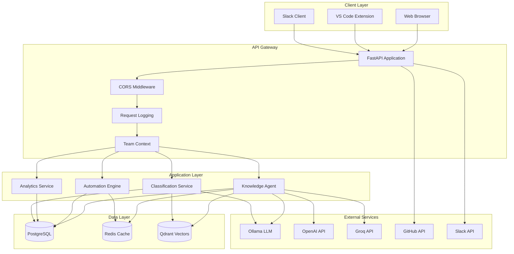

## Data Flow Architecture

### Knowledge Query Flow

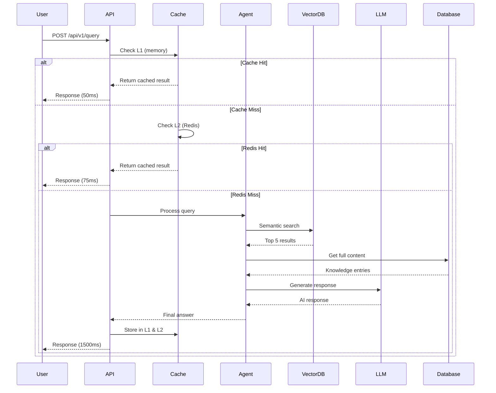

### Knowledge Storage Flow

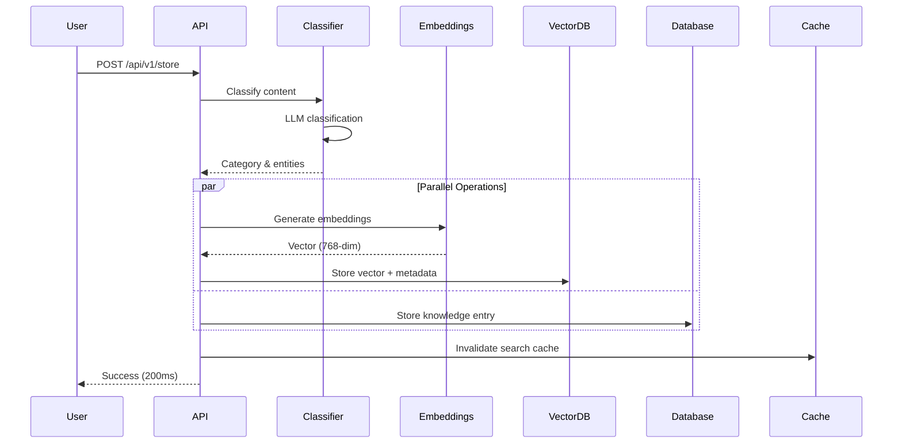

### Automation Rule Execution

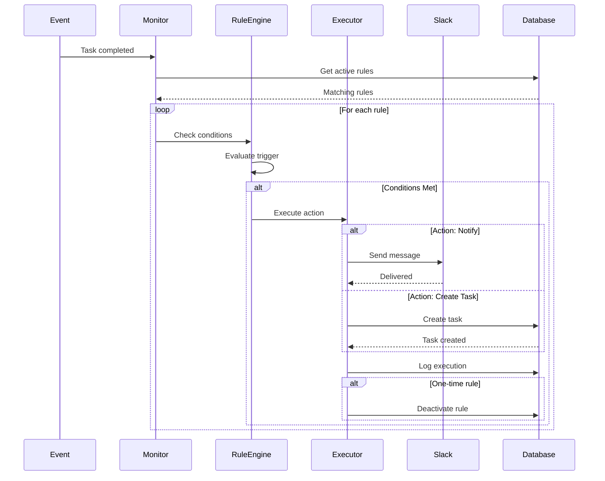

## Component Architecture

### Multi-Level Caching

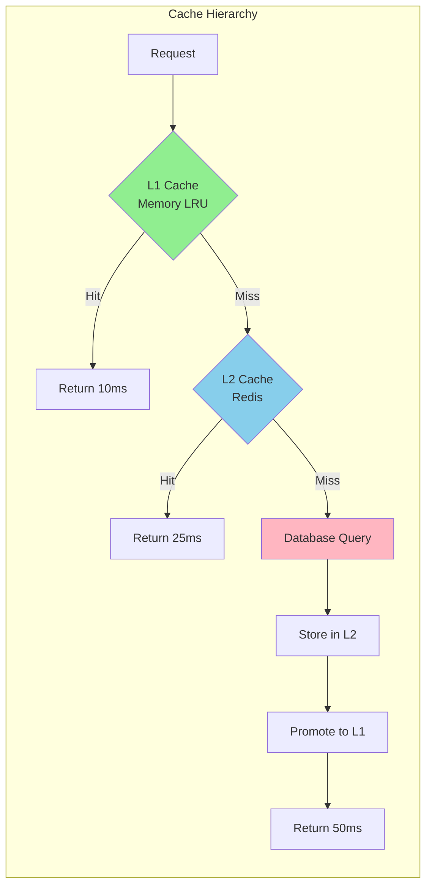

### LLM Provider Fallback

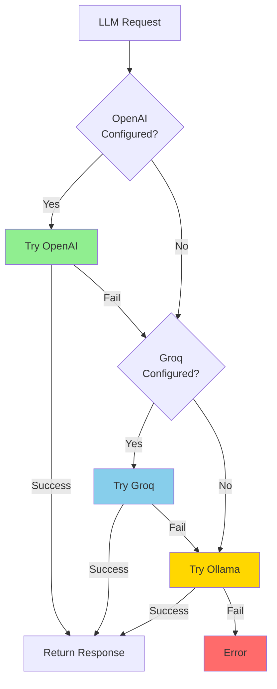

## Database Schema

### Core Entities

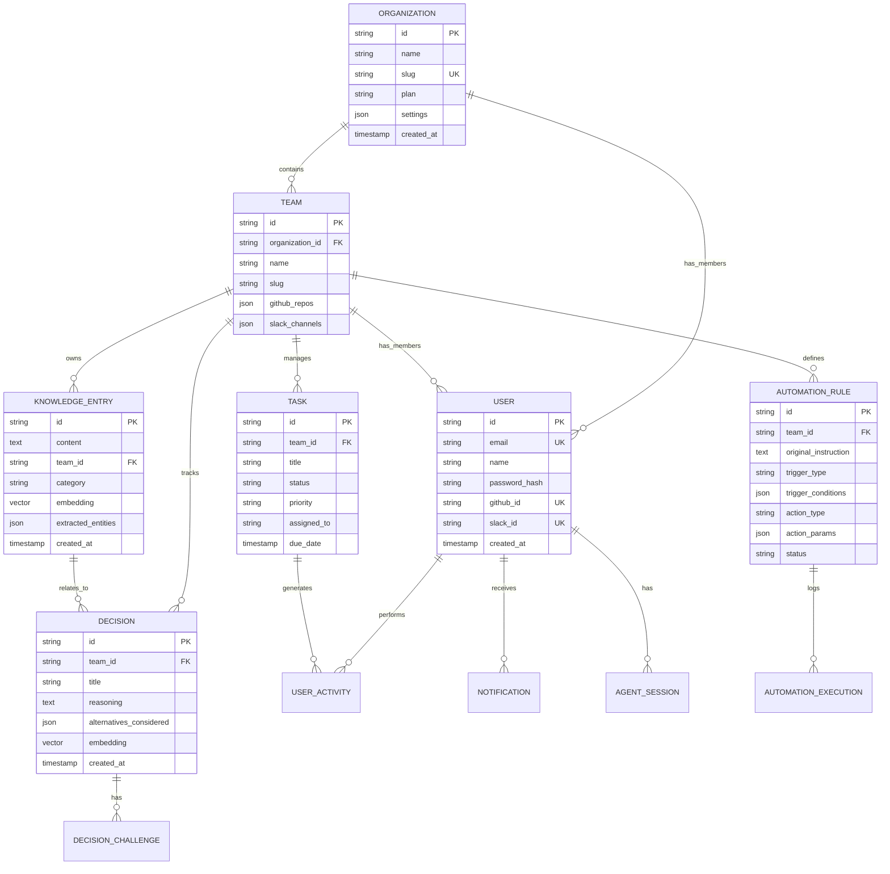

### Vector Store Schema

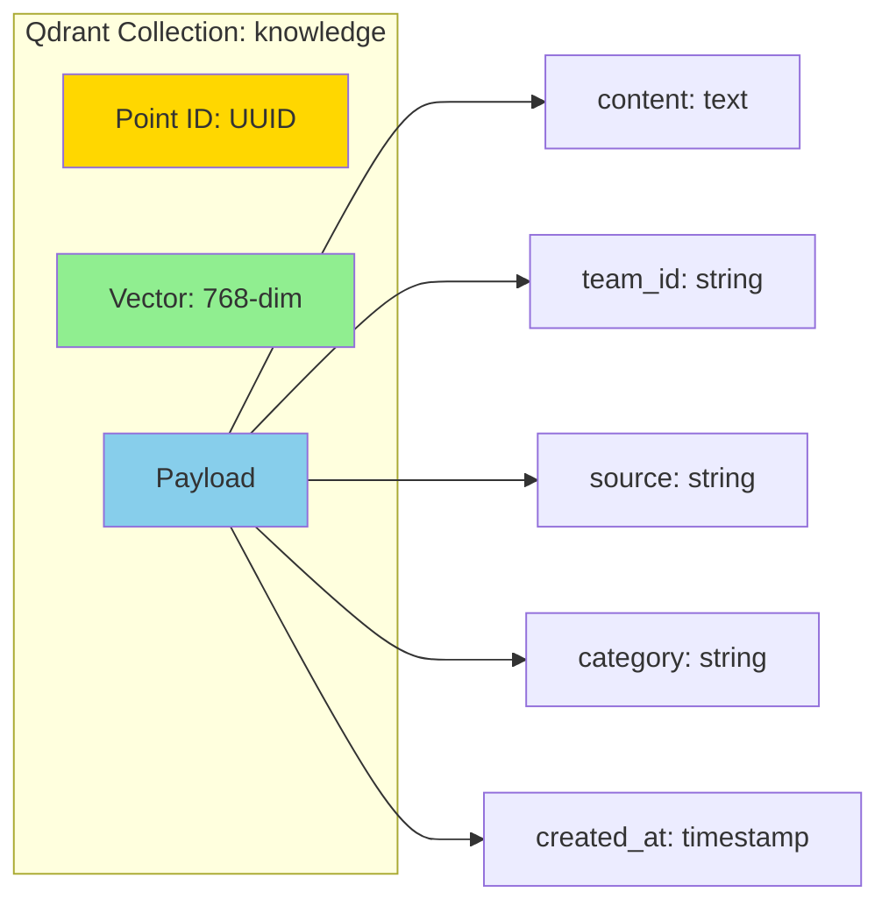

## API Architecture

### RESTful Endpoints

```mermaid
graph TD
    A[/api/v1] --> B[/auth]
    A --> C[/knowledge]
    A --> D[/tasks]
    A --> E[/decisions]
    A --> F[/automation]
    A --> G[/analytics]
    
    B --> B1[POST /register]
    B --> B2[POST /login]
    B --> B3[GET /me]
    
    C --> C1[POST /query]
    C --> C2[POST /store]
    C --> C3[POST /search]
    
    D --> D1[GET /tasks]
    D --> D2[POST /tasks]
    D --> D3[PATCH /tasks/:id]
    
    E --> E1[GET /decisions]
    E --> E2[POST /challenge]
    
    F --> F1[POST /parse]
    F --> F2[GET /rules]
    F --> F3[POST /rules]
    
    G --> G1[GET /productivity/user]
    G --> G2[GET /productivity/team]
    G --> G3[GET /activities]
```

### Middleware Stack

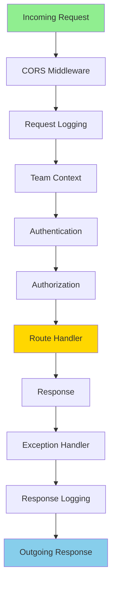

## Integration Architecture

### GitHub Integration

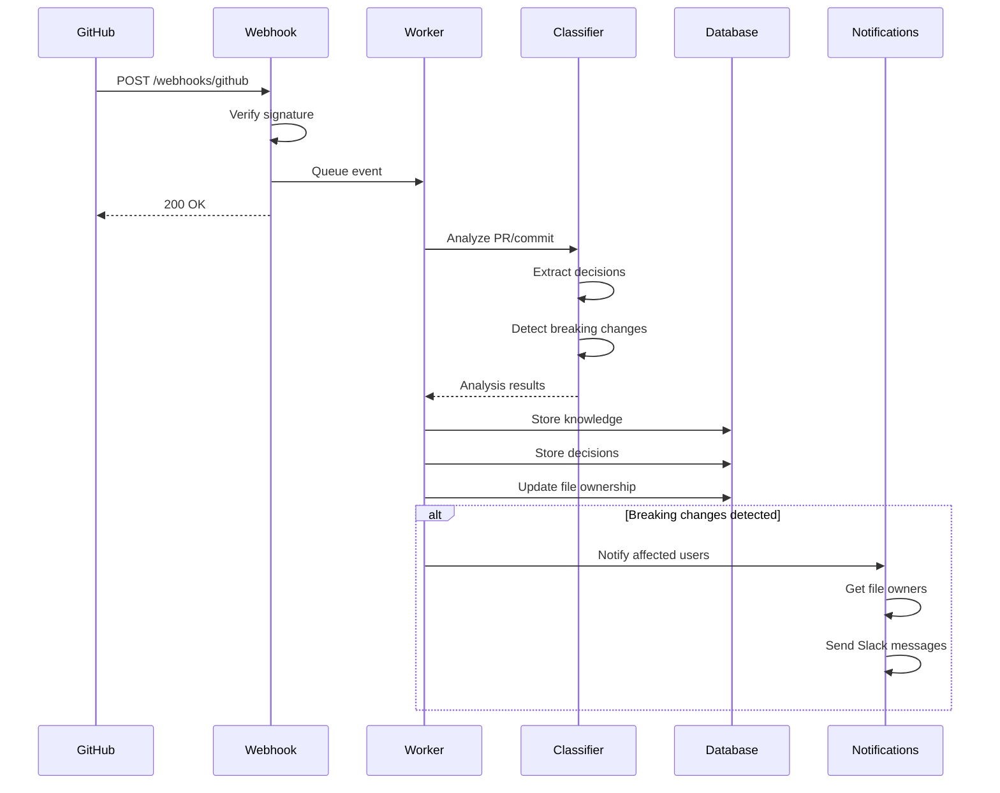

### Slack Integration

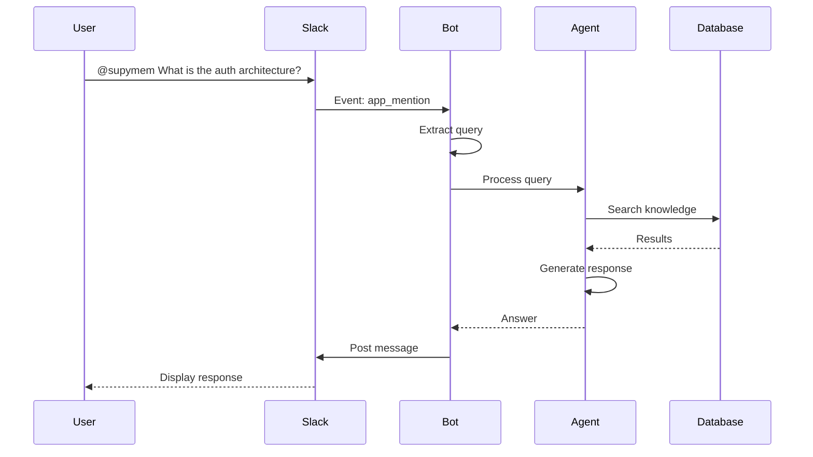

## Deployment Architecture

### Development Environment

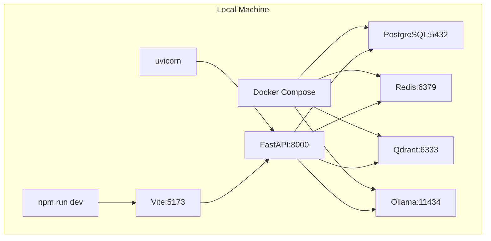

### Production Architecture (Planned)

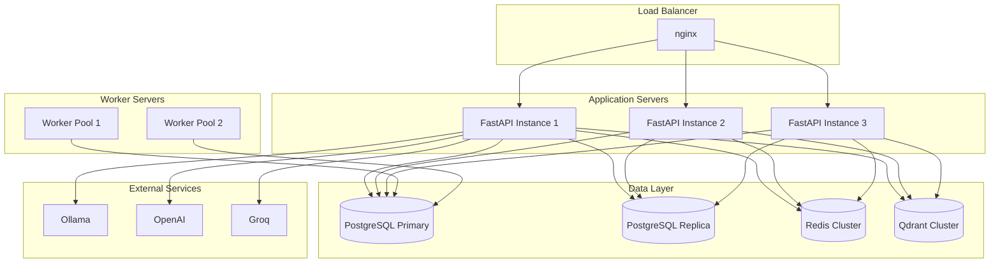

## Security Architecture

### Authentication Flow

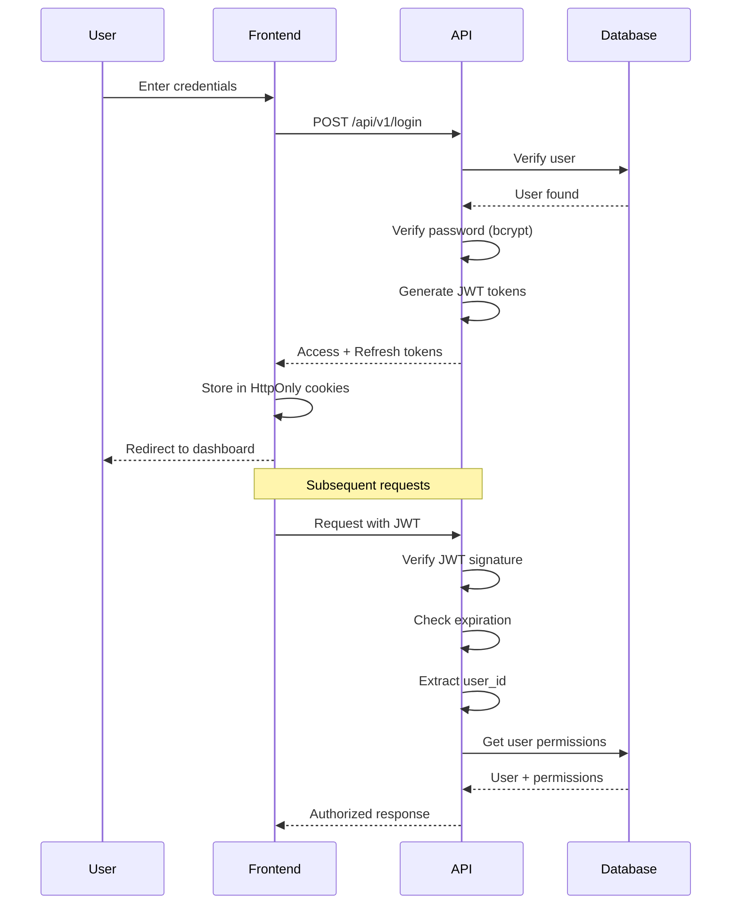

### Authorization Model

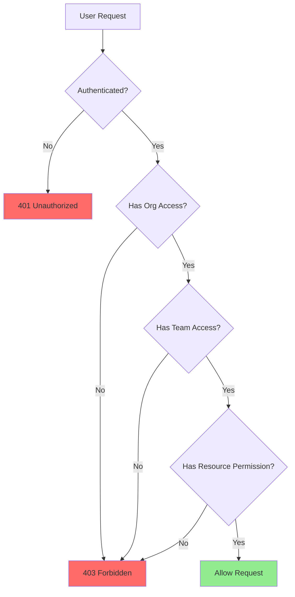

## Monitoring Architecture

### Metrics Collection

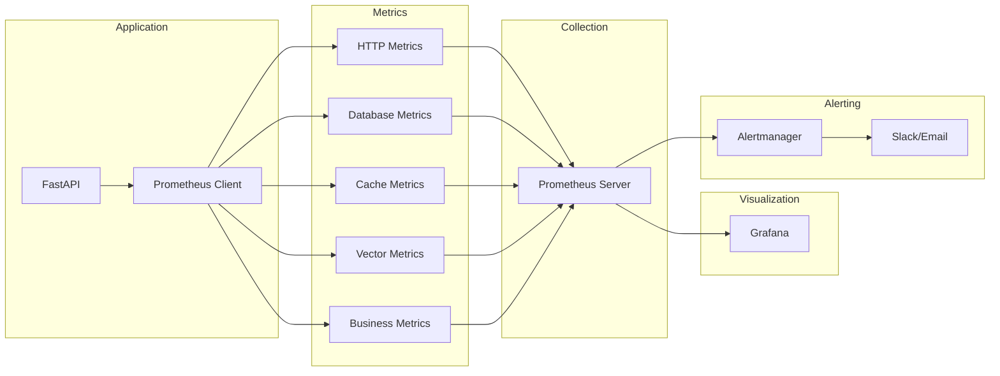

### Logging Pipeline

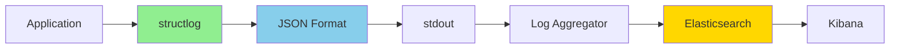

## Performance Optimization

### Query Optimization Strategy

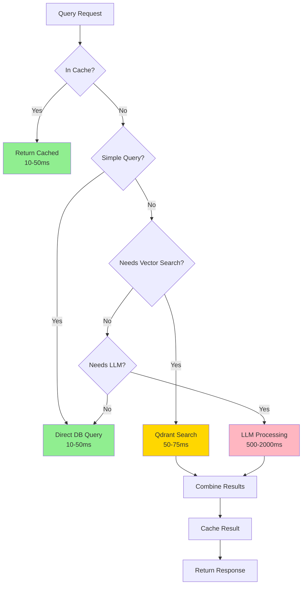

## Scalability Considerations

### Horizontal Scaling

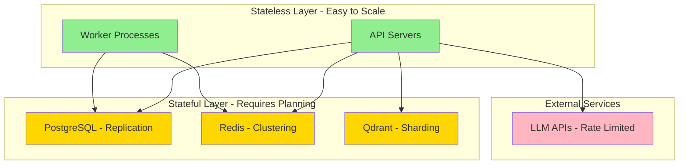

## Technology Stack Summary

| Layer | Technology | Purpose |
|-------|-----------|---------|
| **Frontend** | React 18 + TypeScript | User interface |
| **API** | FastAPI + Python 3.11 | REST API server |
| **Database** | PostgreSQL 17 + pgvector | Relational data + vectors |
| **Cache** | Redis 8.0 | L2 caching |
| **Vector Store** | Qdrant | Semantic search |
| **LLM** | Ollama/OpenAI/Groq | AI processing |
| **Agent** | LangGraph | AI agent framework |
| **Memory** | Mem0 | User memory |
| **Monitoring** | Prometheus + Grafana | Metrics & dashboards |
| **Logging** | structlog | Structured logging |
| **Integrations** | Slack Bolt, PyGithub | External services |

## Design Principles

1. **Async First** - All I/O operations are async
2. **Cache Aggressively** - Multi-level caching for performance
3. **Fail Gracefully** - Automatic fallbacks and retries
4. **Type Safety** - Full type hints in Python, TypeScript in frontend
5. **Observability** - Comprehensive logging and metrics
6. **Security by Default** - Authentication, authorization, encryption
7. **Scalability** - Stateless design, horizontal scaling ready
8. **Developer Experience** - Clear APIs, good documentation

## Future Enhancements

1. **Distributed Tracing** - OpenTelemetry integration
2. **GraphQL API** - Alternative to REST
3. **Real-time Updates** - WebSocket support
4. **Mobile Apps** - iOS and Android clients
5. **Advanced Analytics** - ML-powered insights
6. **Multi-region** - Geographic distribution
7. **Edge Deployment** - CDN integration
8. **Custom Plugins** - Extensibility framework
