# Architecture Design - Task Management System

## Overview

The Task Management System is a modern, cloud-native application built with microservices architecture, real-time collaboration capabilities, and AI-powered features. The system is designed for high availability, scalability, and security while providing an intuitive user experience across web and mobile platforms.

## Architecture

### System Overview

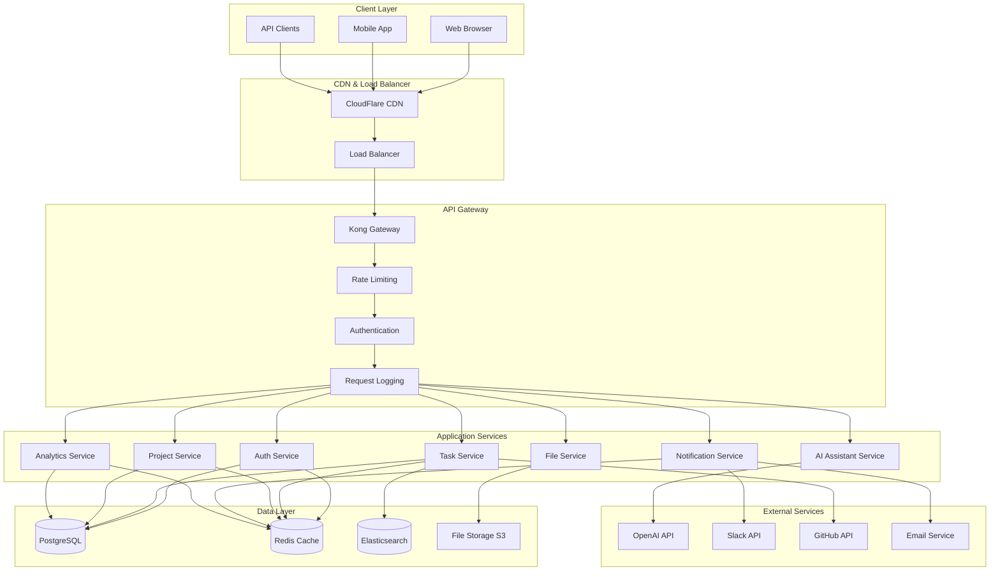

### Microservices Architecture

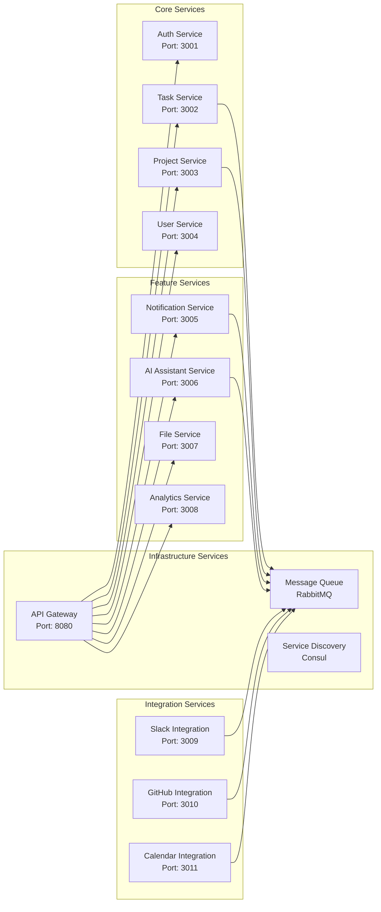

## Components and Interfaces

### Authentication Service

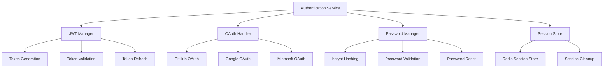

**Key Interfaces:**
- `POST /auth/register` - User registration
- `POST /auth/login` - User authentication
- `POST /auth/refresh` - Token refresh
- `POST /auth/logout` - Session termination
- `GET /auth/oauth/{provider}` - OAuth initiation
- `POST /auth/oauth/callback` - OAuth callback

### Task Management Service

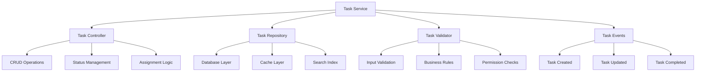

**Key Interfaces:**
- `GET /tasks` - List tasks with filtering
- `POST /tasks` - Create new task
- `GET /tasks/{id}` - Get task details
- `PUT /tasks/{id}` - Update task
- `DELETE /tasks/{id}` - Delete task
- `POST /tasks/{id}/comments` - Add comment
- `PUT /tasks/{id}/status` - Update status

### Real-Time Communication

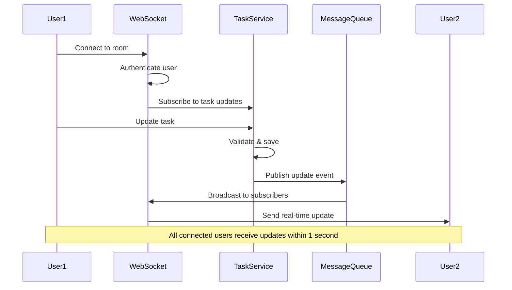

## Data Models

### Core Entity Relationships

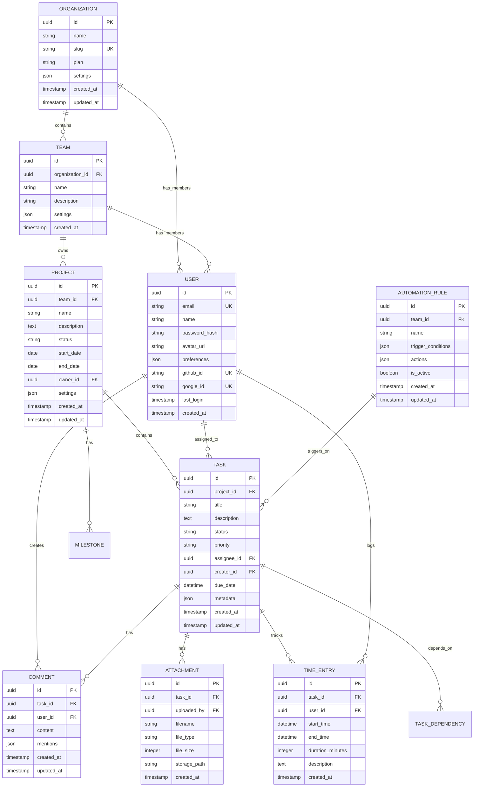

### Database Schema Design

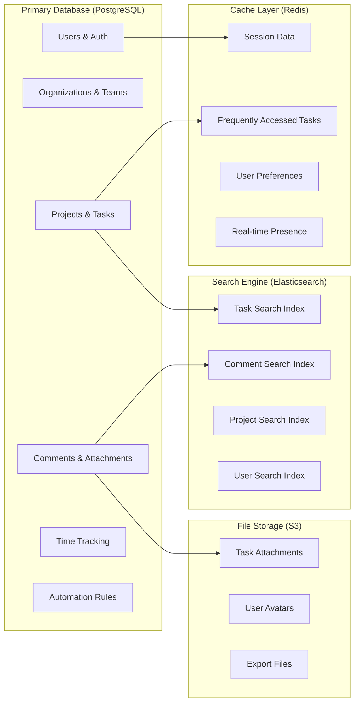

## Correctness Properties

*A property is a characteristic or behavior that should hold true across all valid executions of a system—essentially, a formal statement about what the system should do. Properties serve as the bridge between human-readable specifications and machine-verifiable correctness guarantees.*

Based on the prework analysis, here are the key correctness properties that must be validated through property-based testing:

### Property 1: User Registration Security
*For any* valid email and password combination, when a user registers, the system should create an account with properly encrypted password storage and never store the plain password.
**Validates: Requirements 1.1**

### Property 2: JWT Token Consistency
*For any* valid user credentials, when authentication occurs, the system should issue a JWT token with exactly 15-minute expiry and valid signature.
**Validates: Requirements 1.2**

### Property 3: Token Refresh Mechanism
*For any* expired access token with valid refresh token, the system should issue a new access token and maintain session continuity.
**Validates: Requirements 1.3**

### Property 4: Organization Data Isolation
*For any* organization creation, the system should establish complete data isolation and assign creator as owner with appropriate permissions.
**Validates: Requirements 2.1**

### Property 5: Team-Level Data Filtering
*For any* data query by a user, the system should automatically filter results to include only data accessible to the user's team memberships.
**Validates: Requirements 2.4**

### Property 6: Task Creation Completeness
*For any* task creation request, the system should store all required fields (title, description, assignee, due date, priority) and generate a unique identifier.
**Validates: Requirements 3.1**

### Property 7: Task Completion Workflow
*For any* task marked as complete, the system should update the status and trigger all applicable automation rules within the specified time limit.
**Validates: Requirements 3.3**

### Property 8: Project Progress Calculation
*For any* task added to a project, the system should automatically recalculate and update project progress metrics accurately.
**Validates: Requirements 4.2**

### Property 9: Real-Time Update Broadcasting
*For any* task modification, the system should broadcast updates to all connected team members within 1 second.
**Validates: Requirements 5.1**

### Property 10: AI Suggestion Generation
*For any* task creation, the AI assistant should analyze existing tasks and provide relevant suggestions for similar tasks or potential duplicates.
**Validates: Requirements 6.1**

### Property 11: Notification Delivery
*For any* task assignment, the system should send notifications via the user's preferred channel and track delivery status.
**Validates: Requirements 7.1**

### Property 12: Full-Text Search Accuracy
*For any* search query, the system should perform full-text search across task titles, descriptions, and comments, returning relevant results with proper ranking.
**Validates: Requirements 8.1**

### Property 13: Time Tracking Precision
*For any* time tracking session, the system should accurately record start time, end time, and calculate duration without data loss.
**Validates: Requirements 9.1**

### Property 14: File Upload Security
*For any* file upload to a task, the system should store it securely, generate a unique shareable link, and maintain file integrity.
**Validates: Requirements 10.1**

### Property 15: Integration Task Creation
*For any* Slack message converted to a task, the system should create a properly formatted task and post confirmation back to the channel.
**Validates: Requirements 12.1**

### Property 16: Automation Rule Execution Timing
*For any* task status change, the system should trigger configured automation rules within 5 seconds and log execution results.
**Validates: Requirements 13.1**

### Property 17: API Response Time Performance
*For any* API request under normal load, 95% of responses should complete within 200ms.
**Validates: Requirements 15.1**

## Error Handling

### Error Classification

```mermaid
graph TD
    A[Error Types] --> B[Client Errors 4xx]
    A --> C[Server Errors 5xx]
    A --> D[Business Logic Errors]
    A --> E[Integration Errors]
    
    B --> B1[400 Bad Request]
    B --> B2[401 Unauthorized]
    B --> B3[403 Forbidden]
    B --> B4[404 Not Found]
    B --> B5[409 Conflict]
    B --> B6[422 Validation Error]
    
    C --> C1[500 Internal Server Error]
    C --> C2[502 Bad Gateway]
    C --> C3[503 Service Unavailable]
    C --> C4[504 Gateway Timeout]
    
    D --> D1[Task Assignment Conflicts]
    D --> D2[Project Deadline Violations]
    D --> D3[Permission Violations]
    
    E --> E1[Slack API Failures]
    E --> E2[GitHub API Failures]
    E --> E3[Email Delivery Failures]
```

### Error Response Format

```json
{
  "error": {
    "code": "TASK_NOT_FOUND",
    "message": "The requested task could not be found",
    "details": {
      "task_id": "123e4567-e89b-12d3-a456-426614174000",
      "user_id": "987fcdeb-51a2-43d1-b123-456789abcdef"
    },
    "timestamp": "2024-12-23T10:30:00Z",
    "request_id": "req_abc123def456"
  }
}
```

### Retry and Circuit Breaker Patterns

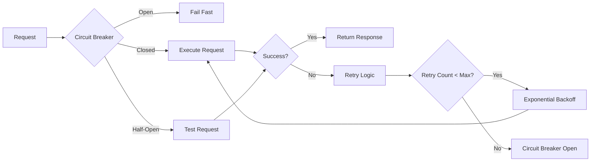

## Testing Strategy

### Dual Testing Approach

The system employs both unit testing and property-based testing to ensure comprehensive coverage:

**Unit Tests:**
- Verify specific examples and edge cases
- Test integration points between services
- Validate error conditions and boundary cases
- Focus on concrete scenarios with known inputs/outputs

**Property-Based Tests:**
- Verify universal properties across all inputs
- Test system behavior with randomized data
- Validate correctness properties defined in the design
- Ensure system invariants hold under all conditions

### Property-Based Testing Configuration

- **Testing Framework:** Hypothesis (Python), fast-check (TypeScript)
- **Minimum Iterations:** 100 per property test
- **Test Tagging:** Each property test references its design document property
- **Tag Format:** `Feature: task-management-system, Property {number}: {property_text}`

### Test Coverage Requirements

- **Unit Test Coverage:** 90% minimum
- **Integration Test Coverage:** All critical user journeys
- **Property Test Coverage:** All correctness properties implemented
- **Performance Test Coverage:** All NFR requirements validated

### Testing Pyramid

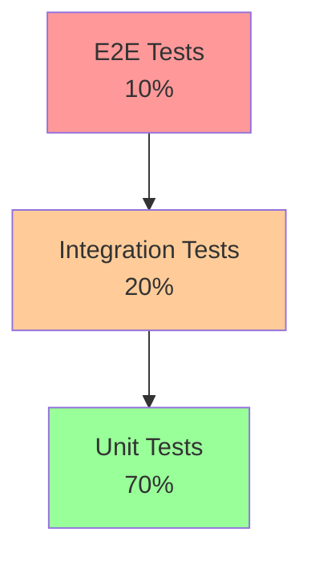

## Deployment Architecture

### Container Architecture

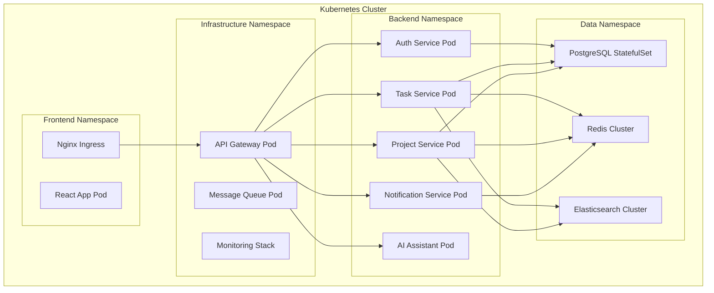

### CI/CD Pipeline

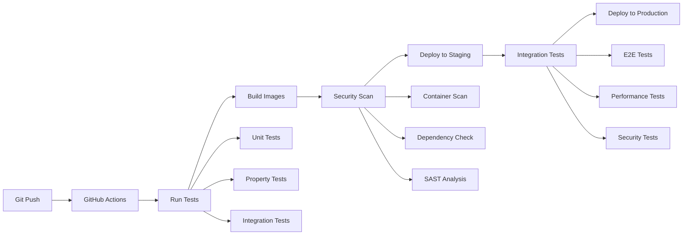

### Environment Configuration

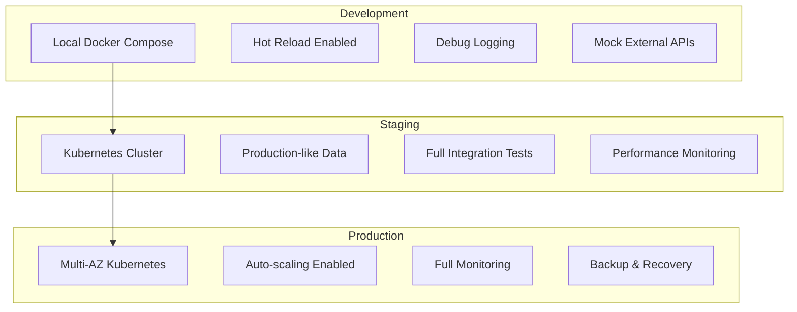

## Security Architecture

### Authentication Flow

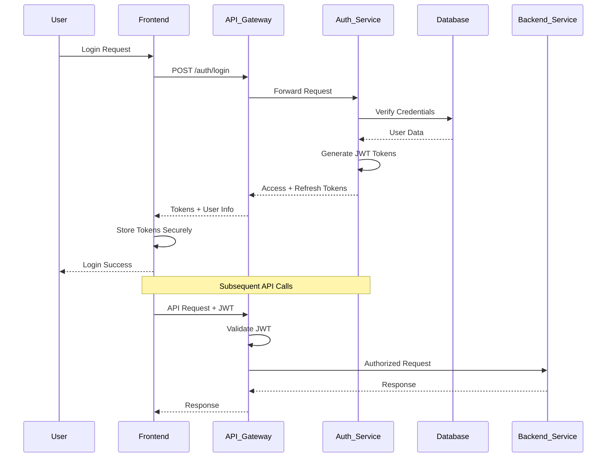

### Authorization Model

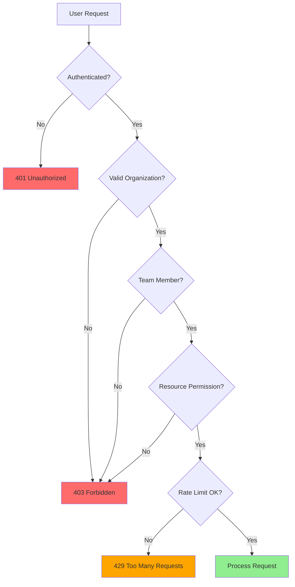

### Data Encryption

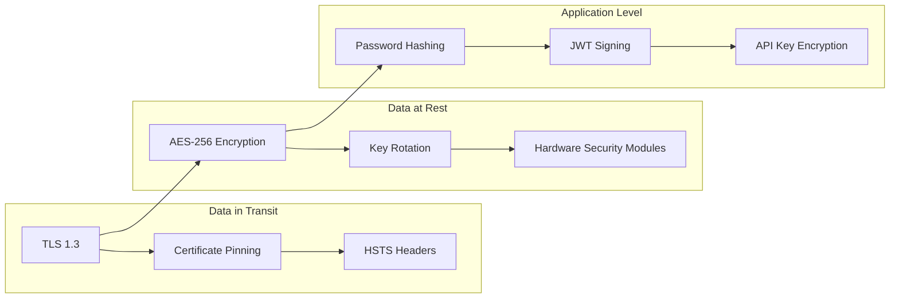

## Monitoring and Observability

### Metrics Collection

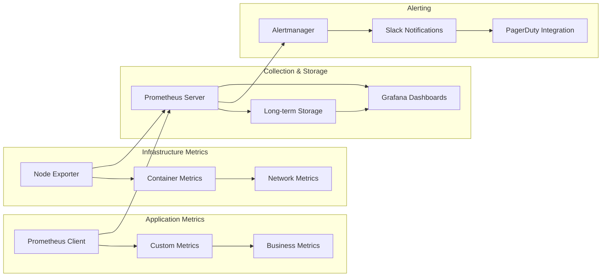

### Logging Strategy

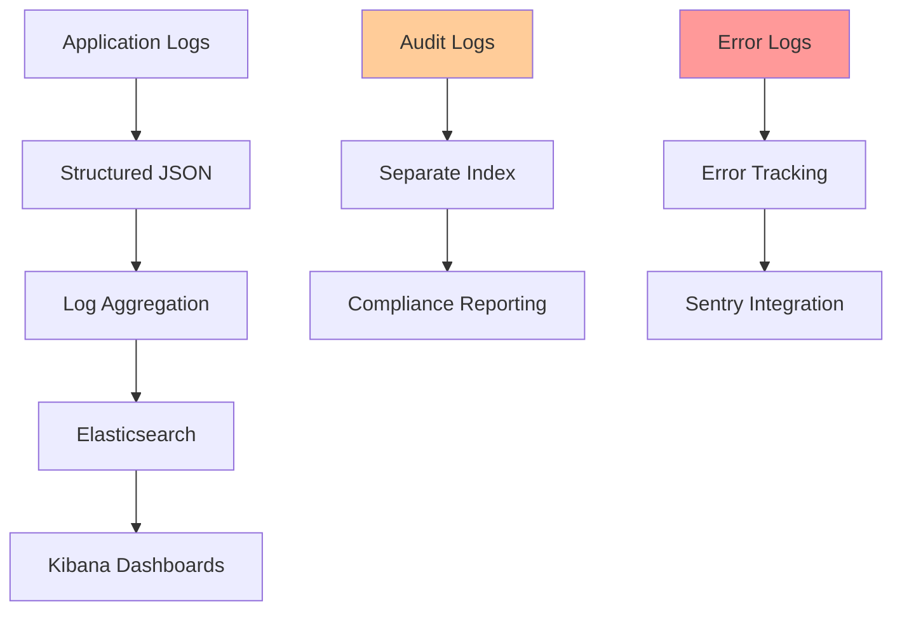

### Distributed Tracing

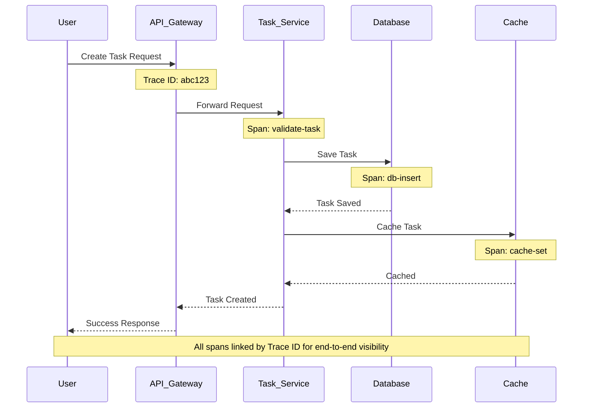

## Performance Optimization

### Caching Strategy

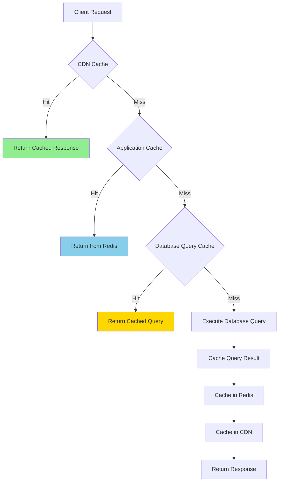

### Database Optimization

```mermaid
graph LR
    subgraph "Query Optimization"
        A[Proper Indexing] --> B[Query Analysis]
        B --> C[Execution Plans]
    end
    
    subgraph "Connection Management"
        D[Connection Pooling] --> E[Connection Limits]
        E --> F[Idle Timeout]
    end
    
    subgraph "Data Partitioning"
        G[Table Partitioning] --> H[Sharding Strategy]
        H --> I[Read Replicas]
    end
    
    A --> D
    D --> G
```

### API Performance

```mermaid
graph TD
    A[API Request] --> B[Rate Limiting]
    B --> C[Request Validation]
    C --> D[Caching Check]
    D --> E[Business Logic]
    E --> F[Database Query]
    F --> G[Response Caching]
    G --> H[Response Compression]
    H --> I[Client Response]
    
    style B fill:#ffa500
    style D fill:#87ceeb
    style G fill:#87ceeb
    style H fill:#90ee90
```

## Scalability Considerations

### Horizontal Scaling

```mermaid
graph TD
    subgraph "Stateless Services (Easy to Scale)"
        A[API Gateway]
        B[Auth Service]
        C[Task Service]
        D[Project Service]
        E[Notification Service]
    end
    
    subgraph "Stateful Services (Requires Planning)"
        F[PostgreSQL Primary]
        G[PostgreSQL Replicas]
        H[Redis Cluster]
        I[Elasticsearch Cluster]
    end
    
    subgraph "Auto-scaling Triggers"
        J[CPU Usage > 70%]
        K[Memory Usage > 80%]
        L[Request Queue Length]
        M[Response Time > 200ms]
    end
    
    A --> F
    B --> F
    C --> F
    D --> F
    E --> H
    
    J --> A
    K --> B
    L --> C
    M --> D
    
    style A fill:#90ee90
    style B fill:#90ee90
    style C fill:#90ee90
    style D fill:#90ee90
    style E fill:#90ee90
    style F fill:#ffd700
    style G fill:#ffd700
    style H fill:#ffd700
    style I fill:#ffd700
```

### Load Distribution

```mermaid
graph LR
    A[Load Balancer] --> B[Service Mesh]
    B --> C[Service A Pod 1]
    B --> D[Service A Pod 2]
    B --> E[Service A Pod 3]
    
    F[Database Load Balancer] --> G[Primary DB]
    F --> H[Read Replica 1]
    F --> I[Read Replica 2]
    
    J[Cache Cluster] --> K[Redis Node 1]
    J --> L[Redis Node 2]
    J --> M[Redis Node 3]
    
    style A fill:#87ceeb
    style F fill:#87ceeb
    style J fill:#87ceeb
```

## Technology Stack

| Layer | Technology | Purpose | Version |
|-------|-----------|---------|---------|
| **Frontend** | React 18 + TypeScript | User interface | 18.2+ |
| **Mobile** | React Native + TypeScript | Mobile applications | 0.72+ |
| **API Gateway** | Kong | Request routing, auth, rate limiting | 3.4+ |
| **Backend Services** | Node.js + TypeScript | Microservices | 20+ |
| **Database** | PostgreSQL | Primary data store | 15+ |
| **Cache** | Redis | Session & data caching | 7+ |
| **Search** | Elasticsearch | Full-text search | 8+ |
| **Message Queue** | RabbitMQ | Async communication | 3.12+ |
| **File Storage** | AWS S3 | File attachments | - |
| **Container Runtime** | Docker | Application packaging | 24+ |
| **Orchestration** | Kubernetes | Container orchestration | 1.28+ |
| **Monitoring** | Prometheus + Grafana | Metrics & dashboards | Latest |
| **Logging** | ELK Stack | Log aggregation & analysis | 8+ |
| **CI/CD** | GitHub Actions | Automated deployment | - |
| **AI/ML** | OpenAI API | AI assistant features | GPT-4 |

## Design Principles

1. **Microservices First** - Loosely coupled, independently deployable services
2. **API-Driven** - All functionality exposed through well-defined APIs
3. **Event-Driven** - Asynchronous communication using events and message queues
4. **Security by Design** - Authentication, authorization, and encryption built-in
5. **Observability** - Comprehensive logging, metrics, and tracing
6. **Scalability** - Horizontal scaling with stateless services
7. **Resilience** - Circuit breakers, retries, and graceful degradation
8. **Performance** - Multi-level caching and query optimization
9. **Developer Experience** - Clear APIs, comprehensive documentation, easy local setup
10. **User Experience** - Responsive design, real-time updates, intuitive interface

## Future Enhancements

1. **Advanced AI Features**
   - Natural language task creation
   - Intelligent task prioritization
   - Predictive analytics for project completion
   - Automated workflow suggestions

2. **Enhanced Collaboration**
   - Video conferencing integration
   - Collaborative document editing
   - Voice notes and transcription
   - Advanced permission models

3. **Mobile Features**
   - Offline task management
   - Push notifications
   - Location-based reminders
   - Camera integration for attachments

4. **Enterprise Features**
   - Single Sign-On (SSO) integration
   - Advanced reporting and analytics
   - Custom fields and workflows
   - API rate limiting and quotas

5. **Integration Ecosystem**
   - Zapier integration
   - Microsoft Teams integration
   - Jira synchronization
   - Time tracking tool integrations